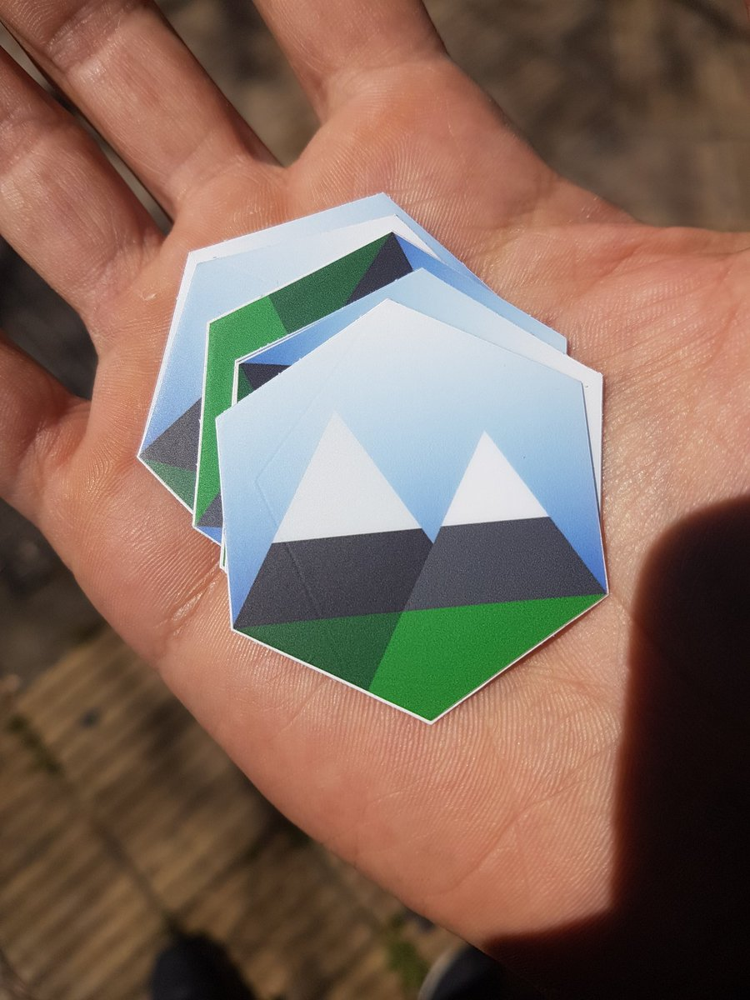

# Welcome

> Documentation, notes, drafts, and information

Welcome the Maintainer Mountaineer's organization on GitHub!

You'll find most of the information you need [on our website](https://maintainer.io). If you have public questions, open an issue here, and we'll do our best to respond as soon as possible. 

If you have private questions, email [richard@maintainer.io](mailto:richard@maintainer.io). 

Join our [Slack Group](https://mntnr.slack.com/shared_invite/MTcxMDc5MTcxMjA1LTE0OTI1NDQ2OTQtYmMyZTc1N2Q2Ng)!

## Resources

Here are some awesome, related resources you can check out.

Developed here:
- [Name Your Contributors](https://github.com/RichardLitt/name-your-contributors) - Name your GitHub contributors; get commits, issues, and comments.
- [Standard Readme](https://github.com/RichardLitt/standard-readme) - One README to rule them all.

Developed elsewhere:
- [Alex](https://github.com/wooorm/alex) Catch insensitive, inconsiderate writing. [Website](http://alexjs.com)
- [Code Triage](https://github.com/codetriage/codetriage) Set up code triaging help for volunteers. _Assumes you have volunteers._

## Common Questions

#### Why is everything licensed by Burnt Fen Creative LLC?

That is [@RichardLitt](https://github.com/RichardLitt)'s shell company he uses for consulting services. Maintainer Mountaineer aims to some day be its own business, but for now, for licensing and invoicing purposes, Burnt Fen Creative is used. 

#### Why are there so many forks?

Maintainer.io policy is to fork repositories when we do public code and repository audits. If we have a fork here, that means we were contacted about auditing a repository. For Maintainer source repositories, you can see [this filter](https://github.com/mntnr?utf8=%E2%9C%93&q=&type=source&language=) on the @mntnr page.

#### Can I haz stickers?

Yes! Send us an email or open an issue with your name and address, and we'll send a few out to you.

## Code of Conduct

Everything @mntnr related follows the [Contributor Covenant](http://contributor-covenant.org/). Please be nice. 

## License

CC-BY-SA-NC 4.0 Unlicensed (c) [Burnt Fen Creative LLC](https://burntfen.com) 2017.
